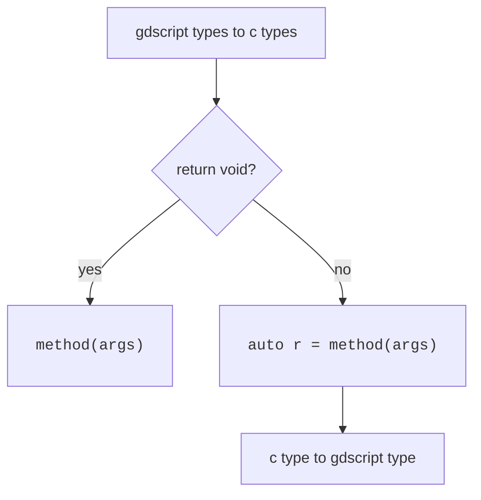
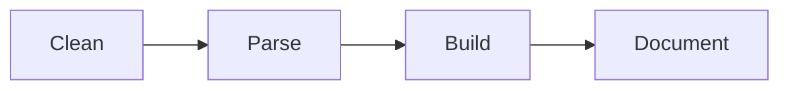

# Development
This GDExtension is **all** built using Python and **nothing** should be add manually at `src`. If this is weird for you, listen to me...  

All that I want is to use the SDK from GDScript, without assuming any setup from the user, which means that I can guess all the logic behind the methods wrappers:  



Knowing this I automated generating all the GDExtension source code through Python code, which is a language that I prefer to user when I don't have to care about low level/security/speed/anything.  

Now that you understand why everything is done through Python, let me explain what is done through Python:  
- Clean headers
- Parse headers
- Build source code
- Document details



**Clean**: Remove unnecessary informations from headers. We are not a C/C++ compiler, so we don't need many lines from the headers and this makes our parser job easier.  

**Parse**: Scan headers to collect useful informations for us. This is closer to be a tokenizer + parser but built together because this is much easier than a scanning a complete programming language.  

**Build**: Build our GDExtension source code (writing `.cpp` and `.h` files in `src/`).  

**Document**: Update the generated XML documentation from Godot (files in `doc_classes/`) with some details to help.  

## Prerequisites
I'm letting this so you can adapt to your operating system.  

### Ubuntu

- [Godot](https://godotengine.org/)
- [SCons](https://scons.org/)
    - `sudo apt install scons`
- [Mingw-w64](https://www.mingw-w64.org/)
    - `sudo apt install mingw-w64`
- [Python](https://www.python.org/) >=3.12
    - Included by default
- [Clang](https://clang.llvm.org/)
    - `sudo apt install clang`
- [Clang format](https://clang.llvm.org/docs/ClangFormat.html)
    - `sudo apt install clang-format`
    - [VSCode](https://marketplace.visualstudio.com/items?itemName=xaver.clang-format)
- [Discord SDK for C++](https://discord.com/developers/docs/discord-social-sdk/getting-started/using-c++#step-4-download-the-discord-sdk-for-c++)

### Fedora

- [Godot](https://godotengine.org/)
- [SCons](https://scons.org/)
    - `sudo dnf install scons`
- Others
    - `sudo dnf install libstdc++-static`
- [Mingw-w64](https://www.mingw-w64.org/)
    - `sudo dnf install mingw64-gcc-c++`
- [Python](https://www.python.org/) >=3.12
    - Included by default
- [Clang](https://clang.llvm.org/)
    - `sudo dnf install clang`
- [Clang format](https://clang.llvm.org/docs/ClangFormat.html)
    - `sudo dnf install clang-tools-extra`
    - [VSCode](https://marketplace.visualstudio.com/items?itemName=xaver.clang-format)
- [Discord SDK for C++](https://discord.com/developers/docs/discord-social-sdk/getting-started/using-c++#step-4-download-the-discord-sdk-for-c++)

## Tree
```
.
├── demo/
│   └── Godot project containing the addon, examples and tests
├── doc_classes/
│   └── Project classes documentation
├── godot-cpp/
│   └── C++ bindings for GDExtension API
├── include/
│   └── Discord headers
├── lib/
│   └── Discord libs
├── scripts/
│   └── Python scripts
└── src/
    └── GDExtension source codes and headers
```

## Step by step
```bash
# Clone repository, submodules and only file needed.
git clone --recurse-submodules --filter=blob:none https://github.com/thiagola92/discord-social-sdk.git
cd discord-social-sdk

# Manually download the DiscordSocialSdk zip to the project directory.

# Unzip libraries and headers to correct directories.
unzip DiscordSocialSdk*.zip -d /tmp/
cp -r /tmp/discord_social_sdk/lib/release/* lib/
cp -r /tmp/discord_social_sdk/bin/release/* lib/
cp -r /tmp/discord_social_sdk/include/* include/
rm -rf /tmp/discord_social_sdk

# Generate GDExtension API files.
cd godot-cpp
godot --dump-extension-api
scons platform=linux custom_api_file=extension_api.json
cd ..

# Generate GDExtension source code.
python3 scripts/main.py

# Generate GDExtension library.
scons platform=linux                            # Debug
scons platform=linux target=template_release    # Release
scons platform=windows                            # Debug
scons platform=windows target=template_release    # Release

# Open project, at least once, to be able to generate GDExtension documentation.
godot ./demo/project.godot

# Rerun to update GDExtension documentation.
python3 scripts/main.py

# Rerun to link GDExtension documentation.
scons platform=linux                            # Debug
scons platform=linux target=template_release    # Release
scons platform=windows                            # Debug
scons platform=windows target=template_release    # Release

# Generate ZIP file for the Asset Library.
zip -r discord_social_sdk.zip demo/addons/discord_social_sdk/**
```

> [!WARNING]
> Make sure that Godot version match with `godot-cpp` repository.  

# References
- [Discord Social SDK Overview](https://discord.com/developers/docs/discord-social-sdk/overview)
- [Discord Social SDK Rich Presence](https://discord.com/developers/docs/rich-presence/using-with-the-discord-social-sdk)
- [Discord Social SDK Reference](https://discord.com/developers/docs/social-sdk/index.html)
- [Doxygen](https://www.doxygen.nl/)