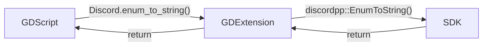

# Introduction
As I already said some times... This GDExtension is just a wrapper around [Discord Social SDK](https://discord.com/developers/docs/discord-social-sdk/overview), which means that you call the GDExtension method and it calls the SDK method.  



Basically, this GDExtension job is convert between Godot variables and C++ variables.  

For example, when you pass a [`String`](https://docs.godotengine.org/en/stable/classes/class_string.html) to a GDExtension method, it will convert to a [`std::string`](https://en.cppreference.com/w/cpp/string/basic_string.html) before passing to the SDK method. And the same convertion needs to happen when returning from SDK, that's what this GDExtension do.  

# Project Tree
```
.
├── demo/
│   └── Godot project containing the addon, examples and tests
├── doc_classes/
│   └── Project classes documentation
├── godot-cpp/
│   └── C++ bindings for GDExtension API
├── include/
│   └── Discord headers
├── lib/
│   └── Discord libs
├── scripts/
│   └── Python scripts
└── src/
    └── GDExtension source codes and headers
```

All the important code is written in Python (inside `scripts`) and this code is responsible for generating the GDExtension code (inside `src`). So let me be very clear...  

> [!CAUTION]
> No code should be manually added to `src` directory.  

# Prerequisites
I'm letting this so you can adapt to your operating system.  

### Ubuntu

- [Godot](https://godotengine.org/)
- [SCons](https://scons.org/)
    - `sudo apt install scons`
- [Mingw-w64](https://www.mingw-w64.org/)
    - `sudo apt install mingw-w64`
- [Python](https://www.python.org/) >=3.12
    - Included by default
- [Clang](https://clang.llvm.org/)
    - `sudo apt install clang`
- [Clang format](https://clang.llvm.org/docs/ClangFormat.html)
    - `sudo apt install clang-format`
    - [VSCode](https://marketplace.visualstudio.com/items?itemName=xaver.clang-format)
- [Discord SDK for C++](https://discord.com/developers/docs/discord-social-sdk/getting-started/using-c++#step-4-download-the-discord-sdk-for-c++)

### Fedora

- [Godot](https://godotengine.org/)
- [SCons](https://scons.org/)
    - `sudo dnf install scons`
- Others
    - `sudo dnf install libstdc++-static`
- [Mingw-w64](https://www.mingw-w64.org/)
    - `sudo dnf install mingw64-gcc-c++`
- [Python](https://www.python.org/) >=3.12
    - Included by default
- [Clang](https://clang.llvm.org/)
    - `sudo dnf install clang`
- [Clang format](https://clang.llvm.org/docs/ClangFormat.html)
    - `sudo dnf install clang-tools-extra`
    - [VSCode](https://marketplace.visualstudio.com/items?itemName=xaver.clang-format)
- [Discord SDK for C++](https://discord.com/developers/docs/discord-social-sdk/getting-started/using-c++#step-4-download-the-discord-sdk-for-c++)

# Step by step
> [!WARNING]
> Make sure that Godot version match with `godot-cpp` repository.  

### Setup repository
```bash
# Clone repository, submodules and only file needed.
git clone --recurse-submodules --filter=blob:none https://github.com/thiagola92/discord-social-sdk.git
cd discord-social-sdk

# Manually download the DiscordSocialSdk zip to the project directory.

# Unzip libraries and headers to correct directories.
unzip DiscordSocialSdk*.zip -d /tmp/
cp -r /tmp/discord_social_sdk/lib/release/* lib/
cp -r /tmp/discord_social_sdk/bin/release/* lib/
cp -r /tmp/discord_social_sdk/include/* include/
rm -rf /tmp/discord_social_sdk

# Generate GDExtension API files.
cd godot-cpp
godot --dump-extension-api
scons platform=linux custom_api_file=extension_api.json
cd ..
```

### Repeat this steps as needed
```bash
# Generate GDExtension source code.
python3 scripts/main.py --code

# Generate GDExtension library.
scons platform=linux                            # Debug
scons platform=linux target=template_release    # Release
scons platform=windows                            # Debug
scons platform=windows target=template_release    # Release

# Open project, at least once, to be able to generate GDExtension documentation.
godot ./demo/project.godot

# Generate GDExtension documentations.
python3 scripts/main.py --docs

# Link documentation to GDExtension library.
scons platform=linux                            # Debug
scons platform=linux target=template_release    # Release
scons platform=windows                            # Debug
scons platform=windows target=template_release    # Release

# Open project (may need to open two times).
godot ./demo/project.godot
```

### Publish addon
```bash
# Generate ZIP file for the Asset Library.
zip -r discord_social_sdk.zip demo/addons/discord_social_sdk/**

# Manually add as assets in your Github release.
```

# References
- [Discord Social SDK Overview](https://discord.com/developers/docs/discord-social-sdk/overview)
- [Discord Social SDK Rich Presence](https://discord.com/developers/docs/rich-presence/using-with-the-discord-social-sdk)
- [Discord Social SDK Reference](https://discord.com/developers/docs/social-sdk/index.html)
- [Doxygen](https://www.doxygen.nl/)
