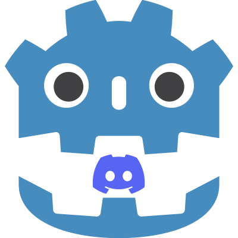

# Discord Social SDK
Wrapper around [Discord Social SDK](https://discord.com/developers/docs/discord-social-sdk/overview).  

<div align="center">

  

</div>

What is Discord Social SDK? You can read about it from Discord it self:
- https://discord.com/developers/docs/discord-social-sdk/overview
- https://discord.com/developers/docs/social-sdk/index.html
- https://support-dev.discord.com/hc/en-us/articles/30127085446039-Introducing-the-Discord-Social-SDK

But if you want me to be brief... It's basically a way to use Discord infrastructure in your game. For example, instead of developing a text/voice chat for your game, you could just request Discord to create one for you.  

What can you do with this SDK:  
- Send/Accept friend request.  
- Block/Unblock users.  
- Send/Read direct messages.  
- Interact with [rich Presence](https://discord.com/developers/docs/rich-presence/overview).  
    - Setup your activity.  
    - Invite to game.  
- Create lobbies.  
    - Use lobby text chat.  
    - Use lobby voice chat.  
- I don't know all functionalities...  

# Platforms
These are the currently supported platforms:  
- Linux (x86_64)
- Windows

If you want to request support for other build, make an [issue](https://github.com/thiagola92/discord-social-sdk/issues).  
If you already knows how to make other build, feel free to make a [pull request](https://github.com/thiagola92/discord-social-sdk/pulls).  

# Installation
> [!IMPORTANT]  
> Before starting, you need to follow 3 steps from [*Getting Started with C++*](https://discord.com/developers/docs/discord-social-sdk/getting-started/using-c++):  
> - Step 1: Create a Discord Developer Team.  
> - Step 2: Create a Discord Application.  
> - Step 3: Enable Discord Social SDK for Your App.  

### Recommended
It's available in [Godot Asset Library](
https://godotengine.org/asset-library/asset/3988), so you can search and install through Godot.  

### Not recommended (manual installation)  
- Go to [releases](https://github.com/thiagola92/discord-social-sdk/releases) from Github.  
- Download latest release ZIP.  
- Extract `addons` directory from ZIP.  
    - It will be inside a `demo` directory.  
- Move `addons` directory to your project directory.  
    - If your project already have an `addons` directory, copy `addons/discord_social_sdk` to your project `addons`.  

# Usage
This GDExtension is a wrapper around the C++ SDK, which means that each GDScript method it's just calling the C++ counterpart.  

If you understand C++, you could easily read a C++ code and convert it to GDScript. For example, I was able to convert their conclusion code from [*Getting Started with C++*](https://discord.com/developers/docs/discord-social-sdk/getting-started/using-c++) to:  

```gdscript
extends Control

# Replace with your Discord Application ID
var APPLICATION_ID: int = 1349146942634065960

var client := DiscordClient.new()
var args := DiscordAuthorizationArgs.new()
var code_verifier: DiscordAuthorizationCodeVerifier = null


func _ready() -> void:
	print("🚀 Initializing Discord SDK...")
	
	client.add_log_callback(_on_log_message, DiscordLoggingSeverity.INFO)
	client.set_status_changed_callback(_on_status_changed)
	
	code_verifier = client.create_authorization_code_verifier()
	
	args.set_client_id(APPLICATION_ID)
	args.set_scopes(DiscordClient.get_default_presence_scopes())
	args.set_code_challenge(code_verifier.challenge())
	client.authorize(args, _on_authorized)


func _process(_delta: float) -> void:
	Discord.run_callbacks()


func _on_log_message(message: String, severity: DiscordLoggingSeverity.Enum) -> void:
	print("[%s] %s" % [Discord.enum_to_string(severity, DiscordLoggingSeverity.id), message])


func _on_status_changed(status: DiscordClientStatus.Enum, error: DiscordClientError.Enum, error_detail: int) -> void:
	print("🔄 Status changed: %s" % status)
	
	if status == DiscordClientStatus.READY:
		print("✅ Client is ready! You can now call SDK functions.")
		print("👥 Friends Count: %s" % client.get_relationships().size())
		
		var activity := DiscordActivity.new()
		activity.set_type(DiscordActivityTypes.PLAYING)
		activity.set_state("In Competitive Match")
		activity.set_details("Rank: Diamond II")
		
		client.update_rich_presence(activity, _on_rich_presence_updated)
	elif error != DiscordClientError.NONE:
		print("❌ Connection Error: %s - Details: %s" % [error, error_detail])


func _on_rich_presence_updated(result: DiscordClientResult) -> void:
	if result.successful():
		print("🎮 Rich Presence updated successfully!")
	else:
		print("❌ Rich Presence update failed")


func _on_authorized(result: DiscordClientResult, code: String, redirect_uri: String) -> void:
	if not result.successful():
		print("❌ Authentication Error: %s" % result.error())
	else:
		print("✅ Authorization successful! Getting access token...")
		
		client.get_token(APPLICATION_ID, code, code_verifier.verifier(), redirect_uri, _on_token_received)


func _on_token_received(
		_result: DiscordClientResult,
		access_token: String,
		_refresh_token: String,
		_token_type: DiscordAuthorizationTokenType.Enum,
		_expires_in: int,
		_scopes: String
) -> void:
	print("🔓 Access token received! Establishing connection...")
	
	client.update_token(DiscordAuthorizationTokenType.BEARER, access_token, _on_token_updated)


func _on_token_updated(result: DiscordClientResult) -> void:
	if result.successful():
		print("🔑 Token updated, connecting to Discord...")
		
		client.connect_discord()
```

Need more examples? Check these two directories:  
- [Discord examples](./demo/examples/discord_examples/).  
    - Examples made using [Discord Social SDK Documentation](https://discord.com/developers/docs/discord-social-sdk/overview) as base.  
	- In my opnion, you should read the official documentation to understand how the SDK works and only look at these examples when curious about the GDScript version.  
- [GDExtension examples](./demo/examples/gdextension_examples/).  
    - Examples made by me (for fun).  

# Security
At first you may think that your Application ID is public information... But it's not!  

Reading [Discord Developer Terms of Service section 2.d](https://support-dev.discord.com/hc/en-us/articles/8562894815383-Discord-Developer-Terms-of-Service), you will find:  

> You will use any developer credentials (such as your **Application ID**, passwords, keys, tokens, and client secrets) we assign to you solely with your Application and the applicable APIs (and will not permit or enable any other Application to use them) and will **treat them as Discord confidential information**...  

This security is needed because Application ID is all that somebody needs to interact with the Discord Social SDK. In other words, knowing your Application ID is everything that a person needs to impersonate your application.  

That's why Discord Social SDK should only be used on games that already have servers (unless someone prove me wrong).  

If your game runs everything locally, that means that you need to put your Application ID in the binary and this means that someone can reverse engineer to get it (even if you [compile with PCK encryption key](https://docs.godotengine.org/en/4.4/contributing/development/compiling/compiling_with_script_encryption_key.html)).  

# The Good, The Bad, The Ugly

### The Good
1. As I said before, the GDExtension is just a wrapper around C++ SDK. In other words, you can probably make all the same things that the C++ SDK can do (I hope).  
2. I belive that they use [Doxygen](https://www.doxygen.nl/) to generate their documentation, which I'm also using in this project. So we probably have the same level of documentation (it may need a little formatting, but we have it!).  

### The Bad
1. As counterpart of C++ [`std::optional<T>`](https://en.cppreference.com/w/cpp/utility/optional) type, I'm using [`Variant`](https://docs.godotengine.org/en/stable/classes/class_variant.html) (which can hold a `null` or an actual value).  
    - This could change in the future if I decide to create my own class "Optional".  
2. Some functions were renamed because their name was already being used in Godot class. I just added a `_discord` to their name.  
    - For example, the class `DiscordClient` will have these two methods:  
        - `connect()`: Godot method [`Object.connect()`](https://docs.godotengine.org/en/stable/classes/class_object.html#class-object-method-connect).  
        - `connect_discord()`: Discord method [`discordpp:Client::Connect()`](https://discord.com/developers/docs/social-sdk/classdiscordpp_1_1Client.html#a873a844c7c4c72e9e693419bb3e290aa).  
3. There is no `uint` in GDScript, so you always receive an `int` from the GDExtension.  
    - If you don't intend to change the data, everything will be fine because there is no data lost when converting between `uint` and `int`.  
    - If you **do** intend to change the data, you should know which operations can corrupt your data.  
    - Reference: https://github.com/godotengine/godot-proposals/issues/9740#issuecomment-2484959346  

### The Ugly
1. Each enum has it own class.  
    - The enum [`discordpp::HttpStatusCode`](https://discord.com/developers/docs/social-sdk/namespacediscordpp.html#a12b04d48d8ea98ec007270a10e0c88ba) will be `DiscordHttpStatusCode`.  
    - The enum [`discordpp::Client::Status`](https://discord.com/developers/docs/social-sdk/classdiscordpp_1_1Client.html#a6f714c5d6aebefa91c1ff8ba97bcce22) will be `DiscordClientStatus`.  
    - This happens because the **Godot C++** doesn't let me use the same name in different enums.  
        - Just to be clear, you can do it through GDScript but **not** through Godot C++.  
        - Any enum created through Godot C++ will also be added as constant for the class.  
            - Creating `Discord.HttpStatusCode.NONE` will also create `Discord.NONE`, which would cause conflict when creating `Discord.ExternalIdentityProviderType.NONE` because would attempt to create another `Discord.NONE`.  
        - Reference: https://github.com/godotengine/godot-cpp/issues/1910  
2. There is no [function overloading](https://www.w3schools.com/cpp/cpp_function_overloading.asp) in GDScript, so I had to change the function signature in any way possible to tell me which function to call.
    - These functions will have an extra performance cost.  
        - In compiled languages, the identification of the right function can be done during compilation.  
        - In interpreted languages that use [Duck typing](https://en.wikipedia.org/wiki/Duck_typing) (like GDScript), this happens during execution.  
    - For example:
        - [`discordpp::EnumToString()`](https://discord.com/developers/docs/social-sdk/namespacediscordpp.html#a0fd967a23d2d106ced3d6669b9a810ad) receives 1 argument which can be many enums:  
            - `discordpp::ActivityActionTypes value`
            - `discordpp::ActivityGamePlatforms value`
            - `discordpp::ActivityPartyPrivacy value`
            - `discordpp::ActivityTypes value`
            - ...
        - `Discord.enum_to_string()` receives 2 arguements, where the second identify which enum:  
            - `value: int, enum_id: int`
                - Where `enum_id` is a constant in the enum class:
                    - `DiscordActivityActionTypes.id`
                    - `DiscordActivityGamePlatforms.id`
                    - `DiscordActivityPartyPrivacy.id`
                    - `DiscordActivityTypes.id`

# Donation

# Development
For development details go to [DEVELOPMENT.md](./DEVELOPMENT.md).  
