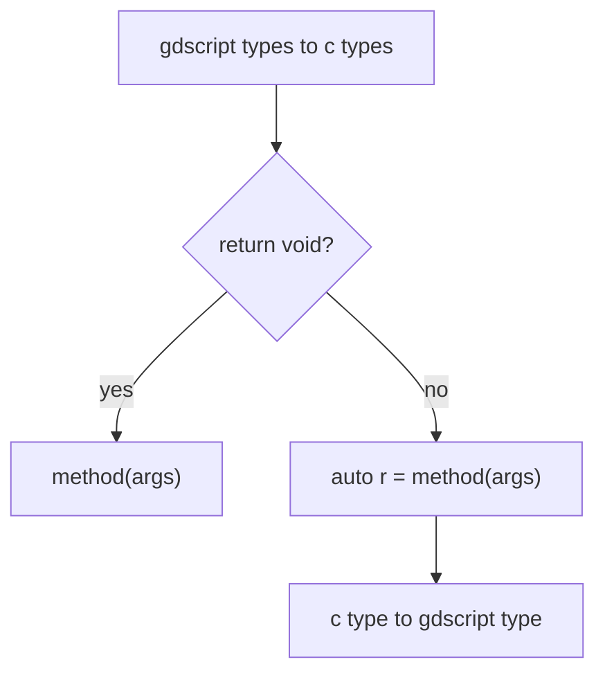
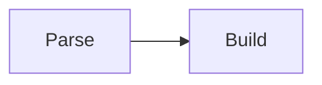

# Discord Social SDK
Wrapper around [Discord Social SDK](https://discord.com/developers/docs/discord-social-sdk/overview).  

There almost no documentation because is very easy to translate code from the [official C++ documentation](https://discord.com/developers/docs/discord-social-sdk/getting-started/using-c++).  

## Examples

**C++**  
```c++
// Replace with your Discord Application ID
const uint64_t APPLICATION_ID = 123456789012345678;

// Create a flag to stop the application
std::atomic<bool> running = true;

// Signal handler to stop the application
void signalHandler(int signum) {
  running.store(false);
}

int main() {
  std::signal(SIGINT, signalHandler);
  std::cout << "🚀 Initializing Discord SDK...\n";

  // Create our Discord Client
  auto client = std::make_shared<discordpp::Client>();

  // Keep application running to allow SDK to receive events and callbacks
  while (running) {
      std::this_thread::sleep_for(std::chrono::milliseconds(10));
  }

  return 0;
}
```

**GDScript**  
```gdscript
# Replace with your Discord Application ID
const APPLICATION_ID = 123456789012345678

func _ready():
  print("🚀 Initializing Discord SDK...)

  # Create our Discord Client
  var client = DiscordClient.new()
```

Godot already runs in loop (like all games), so we don't need to make a loop because we can use `_process()` if we ever need.  

---

**C++**  
```c++
client->AddLogCallback([](auto message, auto severity) {
  std::cout << "[" << EnumToString(severity) << "] " << message << std::endl;
}, discordpp::LoggingSeverity::Info);
```

**GDScript**  
```gdscript
client.AddLogCallback(
  func(message, severity):
      print("[%s] %s" % [Discord.EnumToString(severity), message]),
  DiscordLoggingSeverity.Info
)
```

Note that I don't rename methods to snake_case because this helps me avoid any **possibility** of collision with a Discord method name. For example: `Client::Connection()` with `Node.connection()`.  

---

**C++**
```c++
client->SetStatusChangedCallback([client](discordpp::Client::Status status, discordpp::Client::Error error, int32_t errorDetail) {
  std::cout << "🔄 Status changed: " << discordpp::Client::StatusToString(status) << std::endl;

  if (status == discordpp::Client::Status::Ready) {
    std::cout << "✅ Client is ready! You can now call SDK functions.\n";
  } else if (error != discordpp::Client::Error::None) {
    std::cerr << "❌ Connection Error: " << discordpp::Client::ErrorToString(error) << " - Details: " << errorDetail << std::endl;
  }
});
```

**GDScript**  
```gdscript
client.SetStatusChangedCallback(
  func(status: DiscordClientStatus, error: DiscordClientError, errorDetail: int):
    print("🔄 Status changed: ", DiscordClient.StatusToString(status))

    if status == DiscordClientStatus.Ready:
      print("✅ Client is ready! You can now call SDK functions.")
    elif error != DiscordClientError.None:
      print("❌ Connection Error: % - Details: %s" % [DiscordClientErrorToString(error), errorDetail])
)
```

# Development
This GDExtension is **all** built using Python and **nothing** should be add manually at `src`. If this is weird for you, listen to me...  

All that I want is to use the SDK from GDScript, without assuming any setup from the user, which means that I can guess all the logic behind the methods wrappers:  



Knowing this I automated generating all the GDExtension source code through Python code, which is a language that I prefer to user when I don't have to care about low level/security/speed/anything.  

Now that you understand why everything is done through Python, let me explain what is done through Python: Parsing headers and build source code, that's it.  



When I say parse, I just mean scanning headers to collect informations about the SDK (it's nothing nothing fancy as a C/C++ parser).  

When I say build, I mean writing the source code (`.cpp`) and headers (`.h`) files that the GDExtension will need.  

## Prerequisites
- [Godot](https://godotengine.org/)
- [SCons](https://scons.org/)
    - Debian/Ubuntu: `sudo apt install scons`
- [Python](https://www.python.org/) >=3.12
    - Included in Debian
- Clang format
    - Debian: `sudo apt install clang-format`
    - [VSCode](https://marketplace.visualstudio.com/items?itemName=xaver.clang-format)
- Discord Social SDK in `lib/` directory
    - [Download the Discord SDK for C++](https://discord.com/developers/docs/discord-social-sdk/getting-started/using-c++#step-4-download-the-discord-sdk-for-c++)
        - SDK Version: **1.0.7445**
    - Extract files from:
        - `discord_social_sdk/lib/debug/` to `lib/debug/`
        - `discord_social_sdk/bin/debug/` to `lib/debug/`
        - `discord_social_sdk/lib/release/` to `lib/release/`
        - `discord_social_sdk/bin/release/` to `lib/release/`

## Tree
```
.
├── demo/
│   └── Godot project containing the addon, examples and tests
├── doc_classes/
│   └── Project classes documentation
├── godot-cpp/
│   └── C++ bindings for GDExtension API
├── include/
│   └── Discord headers
├── lib/
│   └── Discord libs
├── scripts/
│   └── Python scripts
└── src/
    └── GDExtension source codes and headers
```

## Execute
```bash
# Generate GDExtension API files.
cd godot-cpp
godot --dump-extension-api
scons platform=linux custom_api_file=extension_api.json
cd ..

# Generate GDExtension source code.
python3 scripts/main.py

# Generate GDExtension documentation.
cd demo
godot --doctool ../ --gdextension-docs
cd ..

# Generate GDExtension library.
scons platform=linux                            # Debug
scons platform=linux target=template_release    # Release
```

# References
- [Discord Social SDK Overview](https://discord.com/developers/docs/discord-social-sdk/overview)
- [Discord Social SDK Rich Presence](https://discord.com/developers/docs/rich-presence/using-with-the-discord-social-sdk)
- [Discord Social SDK Reference](https://discord.com/developers/docs/social-sdk/index.html)
