> **Note**: I'm from Brazil and I'm looking for job, feel free to contact me 🤣

# Discord Social SDK
Wrapper around [Discord Social SDK](https://discord.com/developers/docs/discord-social-sdk/overview).  

<div align="center">

  

</div>

> [!IMPORTANT]  
> Support for:
> - Linux (x86_64)
> - Windows
> 
> If you want to request support for other build, make an [issue](https://github.com/thiagola92/discord-social-sdk/issues).  
> If you already knows how to make other build, feel free to make a [pull request](https://github.com/thiagola92/discord-social-sdk/pulls).  

# Usage
Is suppose to be a close one-to-one with the C++ SDK, so looking at the C++ [*Getting Started*](https://discord.com/developers/docs/discord-social-sdk/getting-started/using-c++) is recommended to understand how the SDK works.  

Here is the final code from *Getting Started* but using this extension:  

```gdscript
extends Node


# Replace with your Discord Application ID
const APPLICATION_ID = 1349146942634065960

var client := DiscordppClient.new()


func _ready() -> void:
    print("🚀 Initializing Discord SDK...")
    
    client.AddLogCallback(
        func(message: String, severity: DiscordppLoggingSeverity.Enum):
            print("[%s] %s" % [severity, message]),
        DiscordppLoggingSeverity.Info
    )
    
    client.SetStatusChangedCallback(
        func(status: DiscordppClientStatus.Enum, error: DiscordppClientError.Enum, errorDetail: int):
            print("🔄 Status changed: %s" % status)
            
            if status == DiscordppClientStatus.Ready:
                print("✅ Client is ready! You can now call SDK functions.")
                print("👥 Friends Count: %s" % client.GetRelationships().size())
                
                var activity := DiscordppActivity.new()
                activity.SetType(DiscordppActivityTypes.Playing)
                activity.SetState("In Competitive Match")
                activity.SetDetails("Rank: Diamond II")
                
                client.UpdateRichPresence(activity,
                    func(result: DiscordppClientResult):
                        if result.Successful():
                            print("🎮 Rich Presence updated successfully!")
                        else:
                            print("❌ Rich Presence update failed")
                )
                
            elif error != DiscordppClientError.None:
                print("❌ Connection Error: %s - Details: %s" % [error, errorDetail])
    )
    
    var code_verifier = client.CreateAuthorizationCodeVerifier()
    
    var args := DiscordppAuthorizationArgs.new()
    args.SetClientId(APPLICATION_ID)
    args.SetScopes(DiscordppClient.GetDefaultPresenceScopes())
    args.SetCodeChallenge(code_verifier.Challenge())
    
    client.Authorize(args,
        func(result: DiscordppClientResult, code: String, redirectUri: String):
            if not result.Successful():
                print("❌ Authentication Error: %s" % result.Error())
            else:
                print("✅ Authorization successful! Getting access token...")
                
                client.GetToken(APPLICATION_ID, code, code_verifier.Verifier(), redirectUri,
                    func(
                        result: DiscordppClientResult,
                        accessToken: String,
                        refreshToken: String,
                        tokenType: DiscordppAuthorizationTokenType.Enum,
                        expiresIn: int,
                        scopes: String
                    ):
                        print("🔓 Access token received! Establishing connection...")
                        
                        client.UpdateToken(
                            DiscordppAuthorizationTokenType.Bearer,
                            accessToken,
                            func(result: DiscordppClientResult):
                                if result.Successful():
                                    print("🔑 Token updated, connecting to Discord...")
                                    client.Connect()
                        )
                )
    )


func _process(_delta: float) -> void:
    Discordpp.RunCallbacks()
```

## Installation
It's available in [Godot Asset Library](
https://godotengine.org/asset-library/asset/3988), so you can search and install through Godot.

**Alternative**:  
- Go to [releases](https://github.com/thiagola92/discord-social-sdk/releases) from Github
- Download latest release ZIP
- Extract `addons` directory from ZIP
    - It will be inside a `demo` directory
- Move `addons` directory to your project directory
    - If your project already have an `addons` directory, copy `addons/discord_social_sdk` to your project `addons`

## Examples
Directory [discord-social-sdk/demo/examples](https://github.com/thiagola92/discord-social-sdk/tree/main/demo/examples) contains many examples.  

Examples in this repository will be mostly convertions from the [official C++ documentation](https://discord.com/developers/docs/discord-social-sdk/development-guides), so I do recommend you to adapt to your like. For example, we don't need to use lambda functions everywhere:  

```gdscript
func _ready() -> void:
    # ...
    client.Authorize(args, _on_authorization_result.bind(code_verifier))


func _on_authorization_result(
    result: DiscordppClientResult,
    code: String,
    redirectUri: String,
    code_verifier: DiscordppAuthorizationCodeVerifier
):
    if not result.Successful():
        print("❌ Authentication Error: %s" % result.Error())
    else:
        print("✅ Authorization successful! Getting access token...")
        client.GetToken(APPLICATION_ID, code, code_verifier.Verifier(), redirectUri, _on_token_result)


func _on_token_result(
    result: DiscordppClientResult,
    accessToken: String,
    refreshToken: String,
    tokenType: DiscordppAuthorizationTokenType.Enum,
    expiresIn: int,
    scopes: String
):
    print("🔓 Access token received! Establishing connection...")
    client.UpdateToken(DiscordppAuthorizationTokenType.Bearer, accessToken, _on_token_update)


func _on_token_update(result: DiscordppClientResult):
    if result.Successful():
        print("🔑 Token updated, connecting to Discord...")
        client.Connect()
```

Instead of running `Discordpp.RunCallbacks()` every frame, you could use a timer which would reduce the frequence which your code stop to run callbacks.  

```gdscript
var timer = Timer.new()
timer.wait_time = 1
timer.autostart = true
timer.timeout.connect(func(): Discordpp.RunCallbacks())
get_tree().root.add_child.call_deferred(timer)
```

## Questions

> Why some functions return [`Variant`](https://docs.godotengine.org/en/stable/classes/class_variant.html)?  

GDScript doesn't has an alternative to [`std::optional<T>`](https://en.cppreference.com/w/cpp/utility/optional), so we just return a Variant which can hold a `null` or an actual value.  

Note: I wiil create a class `Optional` if Godot documentation start giving support to make something like `Optional[T]`.  

> Why exists many functions like `Discordpp.EnumToStringXXX()`?  

GDScript doesn't support [function overloading](https://www.w3schools.com/cpp/cpp_function_overloading.asp), so I just made one function for each option.  

> Why doesn't follow [GDScript style guide](https://docs.godotengine.org/en/stable/tutorials/scripting/gdscript/gdscript_styleguide.html#doc-gdscript-styleguide)?  

I made this decision to avoid solving conflict between methods names because GDScript doesn't support function overloading.  

**Example**: [`discordpp:Client`](https://discord.com/developers/docs/social-sdk/classdiscordpp_1_1Client.html#a873a844c7c4c72e9e693419bb3e290aa) has `Connect()` and [`Object`](https://docs.godotengine.org/en/4.4/classes/class_object.html#class-object-method-connect) has `connect()`.  
If I were to snake_case the `discordpp:Client` method, I would need to find another name for it.   

# Development
This GDExtension is **all** built using Python and **nothing** should be add manually at `src`. If this is weird for you, listen to me...  

All that I want is to use the SDK from GDScript, without assuming any setup from the user, which means that I can guess all the logic behind the methods wrappers:  

```mermaid
flowchart TD
    gd_to_c[gdscript types to c types]
    return_void{return void?}
    call_method1["<pre>method(args)</pre>"]
    call_method2["<pre>auto r = method(args)</pre>"]
    c_to_gd[c type to gdscript type]

    gd_to_c-->return_void
    return_void--"yes"-->call_method1
    return_void--"no"-->call_method2
    call_method2-->c_to_gd
```



Knowing this I automated generating all the GDExtension source code through Python code, which is a language that I prefer to user when I don't have to care about low level/security/speed/anything.  

Now that you understand why everything is done through Python, let me explain what is done through Python:  
- Clean headers
- Parse headers
- Build source code
- Document details


**Clean**: Remove unnecessary informations from headers. We are not a C/C++ compiler, so we don't need many lines from the headers and this makes our parser job easier.  

**Parse**: Scan headers to collect useful informations for us. This is closer to be a tokenizer + parser but built together because this is much easier than a scanning a complete programming language.  

**Build**: Build our GDExtension source code (writing `.cpp` and `.h` files in `src/`).  

**Document**: Update the generated XML documentation from Godot (files in `doc_classes/`) with some details to help.  

## Prerequisites
I'm letting this so you can adapt to your operating system.  

### Ubuntu

- [Godot](https://godotengine.org/)
- [SCons](https://scons.org/)
    - `sudo apt install scons`
- [Mingw-w64](https://www.mingw-w64.org/)
    - `sudo apt install mingw-w64`
- [Python](https://www.python.org/) >=3.12
    - Included by default
- [Clang](https://clang.llvm.org/)
    - `sudo apt install clang`
- [Clang format](https://clang.llvm.org/docs/ClangFormat.html)
    - `sudo apt install clang-format`
    - [VSCode](https://marketplace.visualstudio.com/items?itemName=xaver.clang-format)
- [Discord SDK for C++](https://discord.com/developers/docs/discord-social-sdk/getting-started/using-c++#step-4-download-the-discord-sdk-for-c++)

### Fedora

- [Godot](https://godotengine.org/)
- [SCons](https://scons.org/)
    - `sudo dnf install scons`
- Others
    - `sudo dnf install libstdc++-static`
- [Mingw-w64](https://www.mingw-w64.org/)
    - `sudo dnf install mingw64-gcc-c++`
- [Python](https://www.python.org/) >=3.12
    - Included by default
- [Clang](https://clang.llvm.org/)
    - `sudo dnf install clang`
- [Clang format](https://clang.llvm.org/docs/ClangFormat.html)
    - `sudo dnf install clang-tools-extra`
    - [VSCode](https://marketplace.visualstudio.com/items?itemName=xaver.clang-format)
- [Discord SDK for C++](https://discord.com/developers/docs/discord-social-sdk/getting-started/using-c++#step-4-download-the-discord-sdk-for-c++)

## Tree
```
.
├── demo/
│   └── Godot project containing the addon, examples and tests
├── doc_classes/
│   └── Project classes documentation
├── godot-cpp/
│   └── C++ bindings for GDExtension API
├── include/
│   └── Discord headers
├── lib/
│   └── Discord libs
├── scripts/
│   └── Python scripts
└── src/
    └── GDExtension source codes and headers
```

## Step by step
```bash
# Clone repository, submodules and only file needed.
git clone --recurse-submodules --filter=blob:none https://github.com/thiagola92/discord-social-sdk.git
cd discord-social-sdk

# Manually download the DiscordSocialSdk zip to the project directory.

# Unzip libraries and headers to correct directories.
unzip DiscordSocialSdk*.zip -d /tmp/
cp -r /tmp/discord_social_sdk/lib/release/* lib/
cp -r /tmp/discord_social_sdk/bin/release/* lib/
cp -r /tmp/discord_social_sdk/include/* include/
rm -rf /tmp/discord_social_sdk

# Clear files generated during previous execution.
rm -rf doc_classes
rm -rf src

# Generate GDExtension API files.
cd godot-cpp
godot --dump-extension-api
scons platform=linux custom_api_file=extension_api.json
cd ..

# Generate GDExtension source code.
python3 scripts/main.py

# Generate GDExtension library.
scons platform=linux                            # Debug
scons platform=linux target=template_release    # Release
scons platform=windows                            # Debug
scons platform=windows target=template_release    # Release

# Open project, at least once, to be able to generate GDExtension documentation.
godot ./demo/project.godot

# Generate GDExtension documentation.
cd demo
godot --doctool ../ --gdextension-docs
cd ..

# Rerun to update GDExtension documentation.
python3 scripts/main.py

# Rerun to link GDExtension documentation.
scons platform=linux                            # Debug
scons platform=linux target=template_release    # Release
scons platform=windows                            # Debug
scons platform=windows target=template_release    # Release

# Generate ZIP file for the Asset Library.
zip -r discord_social_sdk.zip demo/addons/discord_social_sdk/**
```

> [!WARNING]
> Make sure that Godot version match with `godot-cpp` repository.  

# References
- [Discord Social SDK Overview](https://discord.com/developers/docs/discord-social-sdk/overview)
- [Discord Social SDK Rich Presence](https://discord.com/developers/docs/rich-presence/using-with-the-discord-social-sdk)
- [Discord Social SDK Reference](https://discord.com/developers/docs/social-sdk/index.html)
- [Doxygen](https://www.doxygen.nl/)