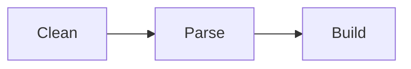

# Discord Social SDK
Wrapper around [Discord Social SDK](https://discord.com/developers/docs/discord-social-sdk/overview).  

Is suppose to be a close one-to-one with the C++ SDK, so looking at the [official C++ documentation](https://discord.com/developers/docs/discord-social-sdk/getting-started/using-c++) is recommended to understand how the SDK works.  

# Usage

I will include some examples but I don't intend to replicate the C++ documentation, you should be able to translate after reading some examples.  

## Examples

**GDScript**  
```gdscript
# Replace with your Discord Application ID
const APPLICATION_ID = 123456789012345678

var client: DiscordppClient = DiscordppClient.new()

func _ready() -> void:
    print("🚀 Initializing Discord SDK...")

    client.AddLogCallback(
        func(message, severity):
            print("[%s] %s" % [Discordpp.EnumToString18(severity), message]),
        DiscordppLoggingSeverity.Info
    )


func _process(delta: float) -> void:
    Discordpp.RunCallbacks()
```

> Why function `Discordpp.EnumToString18()` has a weird name?  

Godot doesn't support [function overloading](https://www.w3schools.com/cpp/cpp_function_overloading.asp), so I just made one function for each option.  

# Development
This GDExtension is **all** built using Python and **nothing** should be add manually at `src`. If this is weird for you, listen to me...  

All that I want is to use the SDK from GDScript, without assuming any setup from the user, which means that I can guess all the logic behind the methods wrappers:  


Knowing this I automated generating all the GDExtension source code through Python code, which is a language that I prefer to user when I don't have to care about low level/security/speed/anything.  

Now that you understand why everything is done through Python, let me explain what is done through Python:  
- Clean headers
- Parse headers
- Build source code



**Clean**: Remove unnecessary informations from headers. We are not a C/C++ compiler, so we don't need many lines from the headers and this makes our parser job easier.  

**Parse**: Scan headers to collect useful informations for us. This is closer to be a tokenizer + parser but built together because this is much easier than a scanning a complete programming language.  

**Build**: Build our GDExtension source code (writing `.cpp` and `.h` files in `src/`).  

## Prerequisites
- [Godot](https://godotengine.org/)
- [SCons](https://scons.org/)
    - Debian/Ubuntu: `sudo apt install scons`
- [Python](https://www.python.org/) >=3.12
    - Included in Debian
- Clang format
    - Debian: `sudo apt install clang-format`
    - [VSCode](https://marketplace.visualstudio.com/items?itemName=xaver.clang-format)
- Discord Social SDK in `lib/` directory
    - [Download the Discord SDK for C++](https://discord.com/developers/docs/discord-social-sdk/getting-started/using-c++#step-4-download-the-discord-sdk-for-c++)
        - SDK Version: **1.0.7445**
    - Extract files from:
        - `discord_social_sdk/lib/debug/` to `lib/debug/`
        - `discord_social_sdk/bin/debug/` to `lib/debug/`
        - `discord_social_sdk/lib/release/` to `lib/release/`
        - `discord_social_sdk/bin/release/` to `lib/release/`

## Tree
```
.
├── demo/
│   └── Godot project containing the addon, examples and tests
├── doc_classes/
│   └── Project classes documentation
├── godot-cpp/
│   └── C++ bindings for GDExtension API
├── include/
│   └── Discord headers
├── lib/
│   └── Discord libs
├── scripts/
│   └── Python scripts
└── src/
    └── GDExtension source codes and headers
```

## Execute
```bash
# Generate GDExtension API files.
cd godot-cpp
godot --dump-extension-api
scons platform=linux custom_api_file=extension_api.json
cd ..

# Generate GDExtension source code.
python3 scripts/main.py

# Generate GDExtension documentation.
cd demo
godot --doctool ../ --gdextension-docs
cd ..

# Generate GDExtension library.
scons platform=linux                            # Debug
scons platform=linux target=template_release    # Release
```

# References
- [Discord Social SDK Overview](https://discord.com/developers/docs/discord-social-sdk/overview)
- [Discord Social SDK Rich Presence](https://discord.com/developers/docs/rich-presence/using-with-the-discord-social-sdk)
- [Discord Social SDK Reference](https://discord.com/developers/docs/social-sdk/index.html)
